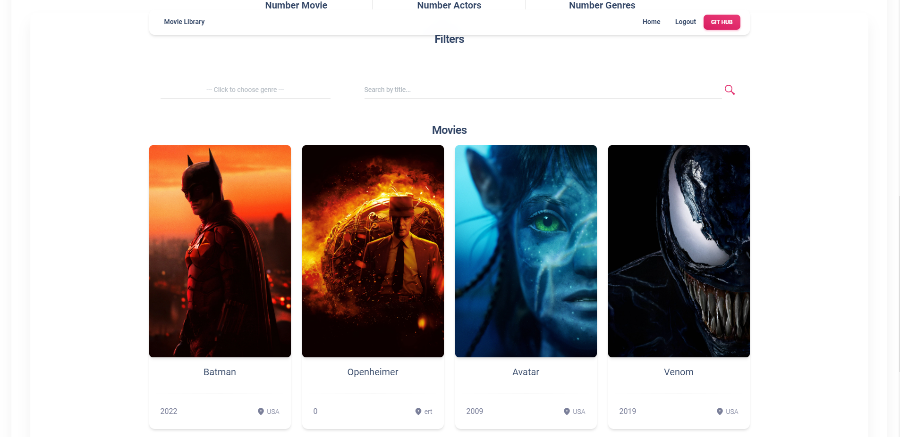

# Movie library project

Django project for searching movie and genres

[Movie Library deployed on Render](https://movie-library-hw3f.onrender.com/)

## Instalation

Python3 must be already installed

```shell
git clone https://github.com/Vitalii-Khmura/movie-library.git
cd movie_library
python -m venv venv
venv/Scripts/activate
pip innstall requirements.txt

python manage.py runserver
```

Then you should create an ```.env``` file and enter in this file ```SECRET_KEY```

```shell
    SECRET_KEY=your_secret_key
```

All Environment variables that should be in .env file are specified in the .env_sample file

Finally, perform the migration, write next command in terminal:

```shell
    python manage.py makemigrations
    python manage.py migrate
```

After loading data from fixture you can use following superuser (or create another one by yourself):
* Login: ```test_user```
* Password:```123456```

## Features

* Authentication functionality for User
* Searching movie & genres directly from website
* Detailed information about each film


## Demo


